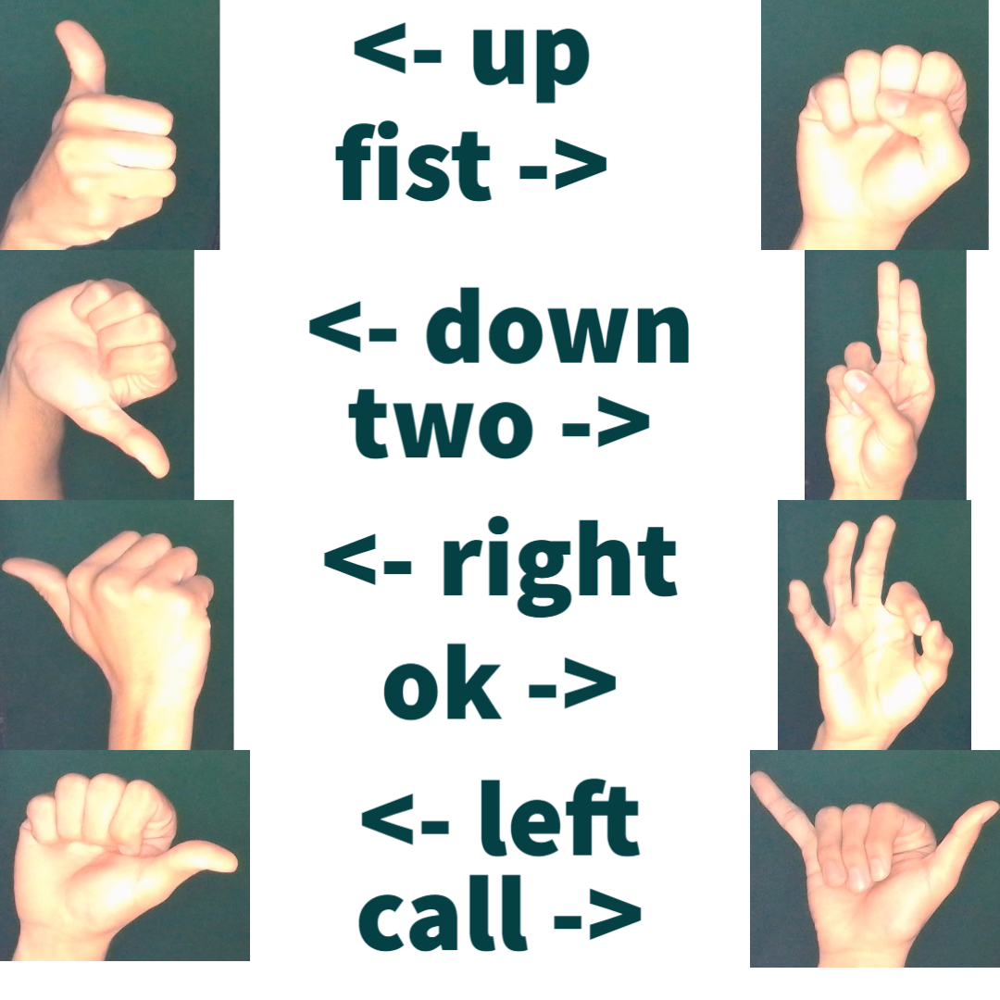

## Gestures for Home Control

This is a project made for CS530 (Systems Programming) class at San Diego State.  

Gestures for Home Control is gesture-based home control system and was made to be an alternative to Alexa (Amazon's voice based home control). At the moment, Gestures for Home Control implements the following APIs: [Nest](https://developers.google.com/nest/device-access), Kasa (not public), and [Spotify](https://developer.spotify.com/documentation/web-api/). These APIs are used in conjunction with these [gestures](#gestures) in order to link each API to the respective commands. In addition to gestures, Gestures for Home Control also recognizes a circle pattern in order to change thermostat temperature and or volume for an easy and interative way to control your home. 


### Table of Contents
- [Getting Started](#getting-started)
- [Gestures](#gestures)
- [APIs](#apis)
    - [Nest](#nest-api)
    - [Spotify](#spotify-api)
    - [Kasa](#kasa-api)

### Getting Started:
<details><summary>Installation</summary>
<p>  
#### 1. Git:  
Make sure you have Git installed on your computer. Follow [these steps](https://github.com/git-guides/install-git) if you don't have Git already.  
```shell
# make sure you are in a directory that you want to put the project in
# make a copy of the repository on your computer
git clone https://github.com/Zracano/Gesture-Recognition
```

#### 2. Creating an environment:  
[Instructions to install conda](https://conda.io/projects/conda/en/latest/user-guide/install/index.html)  

The file **environment.yml** describes the python version and various dependencies with specific version numbers. 
To activate the environment perform the following in your command line:  
```shell
# creates the environment from the specifications file (only needs to be done once)
conda env create -f environment.yml
# activates the environment which (may need to be done each time you restart the terminal
conda activate GestureRecognition
# list all dependencies for that environment
conda env list
```
#### 3. Open nest_secrets.py, spotify_secrets.py, and kasa_secrets.py to add your API tokens and login  
#### 4. Make sure you have your camera turned on and applications have permision to use it  
#### 5. Run `python gesture_detection_main.py` in your terminal 
#### 6. Finally use any of the following gestures to control your Home.

</p>
</details>

### Gestures:  
  

- Thumb up   &#8594; Start/Resume Song (Spotify)  
- Thumb down &#8594; Pause Song  
- Right      &#8594; Next Song  
- left       &#8594; Previous Song  
- ok 	     &#8594; Change thermostat mode to COOL (Nest)  
- two        &#8594; Change thermostat mode to HEAT  
- fist       &#8594; Returns the current mode of thermostat  
- call + thumbs up   &#8594; Turn on device (Kasa)  
- call + thumbs down &#8594; Turn off device  
- Clockwise Circle Pattern:  
    - Spotify Playing &#8594; Increase Volume  
    - Spotify Not Playing  &#8594; Increase Temperature  
- Counter-Clockwise Pattern:  
    - Spotify Playing &#8594; Decrease Volume  
    - Spotify Not Playing &#8594; Decrease Temperature  

## APIs

#### Nest API
###### Purpose: Control thermostat temperature and modes.
```python
#########################################################################
# All methods return "ERROR" or "CONNECTION_ERROR" if there is an error #
#########################################################################

# get current mode of Nest Thermostat 
# returns string ("COOL" -OR- "HEAT" -OR- "OFF")
get_current_temp_mode()

# get current temp 
# returns int (mode="OFF" -> 0 -OR- mode="HOT" or "COOL" -> temperature)
get_current_temp()

# parameter 1: value - int{set-temperature via [number]} -OR- string{set-mode via ["OFF", "HOT", "COOL"]}
# parameter 2: command - string{"SetCool", "SetHeat", "SetMode"}
# info 1: "SetCool", "SetHeat" are used alongside temperature number
# info 2: "OFF", "HOT", "COOL" used alongside "SetMode"
# Sample Method 1: update_thermostat(72, "SetCool" or "SetHeat")
# Sample Method 2: update_thermostat("OFF" or "HOT" or "COOL", "SetMode")
# returns nothing if successful
update_thermostat(value, command)
```

#### Spotify API
###### Purpose: Play a spotify playlist and control playback.  
```python
#########################################################################
# All methods return "ERROR" or "CONNECTION_ERROR" if there is an error #
########################  "SUCCESS OTHERWISE"  ##########################
#########################################################################

# starts/resumes playback
start_playback()
    
# pauses playback
pause_playback()

# skips to the next song in playback
skip_playback()

# goes back to previous song in playback
previous_playback()

# return playing status of device
is_playing()

# Change playback volume 
# paramter: increment - signed int{change volume via based on increment value}
change_volume(increment)
```

#### Kasa API
###### Purpose: Control a fan/light to turn ON or OFF.  
```python
# turn Kasa SmartPlug ON or OFF
# fan/light is connected to SmartPlug so it will turn them ON/OFF
flip_switch(new_state)
```